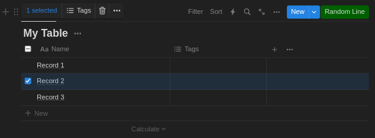

# NotionRoll

A Google Chrome extension that adds a button to Notion's table views for selecting a random record.

Example:  

### How to add the extension:
1. Clone the repository
2. In Chrome, go to _Extensions_ → _Manage Extensions_ → _Load unpacked_ and select the cloned repository  
